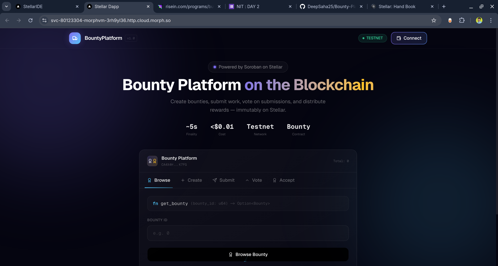

# Bounty Platform

A full-stack decentralized bounty application built on Stellar Soroban.




Users can:
- Create funded bounties
- Submit work links
- Vote on submissions
- Finalize and pay the winning submission after deadline

The repository contains:
- A Soroban smart contract (Rust)
- A Next.js frontend (TypeScript) connected via Freighter wallet

## Deployed Contract

- Network: Stellar Testnet
- Contract address: `CA4X4H5SVVETYWEDTDEN6BDXDT352BDF5FXN2PQ5NU6NVIGXSFWPK7FG`
- Contract explorer:
- https://lab.stellar.org/smart-contracts/contract-explorer?$=network$id=testnet&label=Testnet&horizonUrl=https:////horizon-testnet.stellar.org&rpcUrl=https:////soroban-testnet.stellar.org&passphrase=Test%20SDF%20Network%20/;%20September%202015;&smartContracts$explorer$contractId=CA4X4H5SVVETYWEDTDEN6BDXDT352BDF5FXN2PQ5NU6NVIGXSFWPK7FG;

## Project Structure

```text
Bounty-Platform/
├─ client/                      # Next.js frontend
│  ├─ app/                      # App Router pages
│  ├─ components/               # UI + contract interaction components
│  └─ hooks/contract.ts         # Soroban + Freighter integration
└─ contract/                    # Soroban workspace
	└─ contracts/contract/       # Bounty contract source + tests
```

## Core Features

- On-chain bounty creation with token escrow
- Time-based submission and voting windows
- One-vote-per-wallet protection per submission
- Winner selection by highest votes after deadline
- Automatic reward payout from contract to winning submitter
- Read APIs for bounty, submissions, and vote status

## Smart Contract API

Primary contract methods:
- `create_bounty(creator, title, description, token, reward, deadline)`
- `submit(submitter, bounty_id, url)`
- `vote(voter, bounty_id, submission_id)`
- `accept(bounty_id)`
- `get_bounty(bounty_id)`
- `get_bounty_count()`
- `get_submissions(bounty_id)`
- `has_voted(voter, bounty_id, submission_id)`

The contract logic is implemented in `contract/contracts/contract/src/lib.rs`.

## Tech Stack

- Smart contract: Rust + Soroban SDK
- Frontend: Next.js 16, React 19, TypeScript, Tailwind CSS
- Wallet integration: Freighter API
- Blockchain access: `@stellar/stellar-sdk`

## Prerequisites

Install the following before running the project:
- Node.js 20+
- npm
- Rust toolchain (stable)
- Soroban/stellar CLI (`stellar` command)
- Freighter browser wallet extension (for signing transactions)

## Quick Start

### 1) Run Frontend

```bash
cd client
npm install
npm run dev
```

Open `http://localhost:3000`.

### 2) Build and Test Contract

```bash
cd contract/contracts/contract
make build
make test
```

Alternative test command:

```bash
cargo test
```

## Frontend Contract Configuration

Frontend chain/wallet settings live in `client/hooks/contract.ts`:
- `CONTRACT_ADDRESS`
- `NETWORK_PASSPHRASE`
- `RPC_URL`
- `HORIZON_URL`
- `NETWORK`

If you deploy a new contract instance, update `CONTRACT_ADDRESS` before running the UI.

## Typical User Flow

1. Connect Freighter wallet.
2. Create a bounty with token address, reward, and deadline.
3. Contributors submit work URLs.
4. Users vote on submissions before deadline.
5. After deadline, call `accept` to mark winner and transfer reward.

## Testing

Contract unit tests cover:
- Bounty creation and retrieval
- Submission and voting flows
- Payout behavior
- Deadline restrictions
- Double-vote rejection
- Multi-bounty and multi-submission scenarios

Tests are in `contract/contracts/contract/src/test.rs`.

## Notes

- The frontend currently targets Stellar Testnet.
- `accept` can only succeed after the bounty deadline.
- Voting and submission are blocked after deadline.

## Contributing

1. Fork and clone the repository.
2. Create a feature branch.
3. Add changes with tests where applicable.
4. Open a pull request with a clear description.

## License

No license file is currently defined in this repository.
